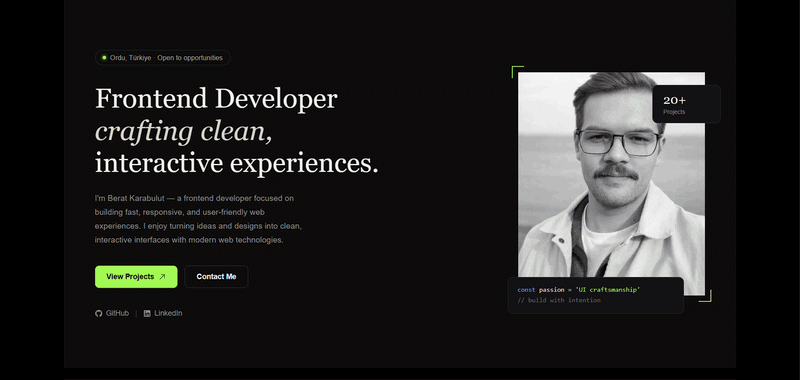

# Personal Portfolio

A modern, responsive personal portfolio website built with **React and TypeScript**.

The application presents personal information, technical skills, selected projects and contact information in a single-page interface. Project data is partially retrieved dynamically from GitHub and combined with locally defined metadata for presentation.

The project is deployed using **Firebase Hosting**.

## 🎥 Preview



---

## 🌐 Live Demo

**Portfolio:**
https://beratkarabulutt.web.app/

---

## 🛠️ Technologies

* React
* TypeScript
* Redux Toolkit
* Axios
* GitHub API
* Swiper
* Formik
* Yup
* EmailJS
* Firebase Hosting
* MUI
* CSS

---

## ✨ Features

### Single-Page Component Architecture

The portfolio is structured as a single-page application with independent React components for each major section.

The main page is composed of sections such as:

* Hero
* About
* Technologies
* Projects
* Contact

Each section is implemented independently and integrated into the main application, keeping the structure modular and easier to maintain.

---

### GitHub API Integration

Project information is retrieved dynamically from GitHub using the GitHub API.

The application uses:

* Axios for HTTP requests
* `createAsyncThunk` for asynchronous operations
* GitHub repository topics for filtering
* Repository information such as name, description and URL

The data retrieved from GitHub is combined with locally defined project metadata. This metadata provides presentation-specific information such as:

* Project image
* Category
* Technologies
* Display order
* Live demo URL

This approach keeps the project content dynamic while allowing additional presentation data to be managed independently from the GitHub repositories.

---

### Project Showcase

Selected projects are displayed through an interactive **Swiper** slider.

Project cards receive their data through props and display relevant information such as project name, description, technologies and available links.

Project-specific presentation data is maintained separately in the application's data layer rather than being directly embedded inside the components.

---

### Redux Toolkit

**Redux Toolkit** is used for centralized state management.

Asynchronous operations are handled using `createAsyncThunk`, including GitHub API requests and contact-related operations.

The Redux state also manages request statuses such as loading and completion states, allowing the interface to respond appropriately while asynchronous operations are in progress.

---

### Contact Form

The contact section integrates several tools for form management and communication:

* **Formik** for form state management
* **Yup** for form validation
* **EmailJS** for sending messages

Validation is performed before submission, while asynchronous contact operations are handled through the application's state management structure.

---

### TypeScript

TypeScript is used throughout the application to provide type safety and maintainable data structures.

Custom types are defined for application data, component props and project metadata.

Example:

```ts
export const projectMeta: Record<string, ProjectMeta> = {
  "Gupse-Cafe-Menu-System": {
    image: gupseCafeImage,
    category: "Menu System",
    technologies: ["Html", "Css", "JavaScript"],
    order: 1,
  },
};
```

This keeps project-related data structured and predictable throughout the application.

---

## 📂 Project Structure

A simplified version of the project structure:

```text
src/
├── components/
│   ├── Hero/
│   ├── About/
│   ├── Tech/
│   ├── Projects/
│   ├── Contact/
│   └── ...
│
├── data/
│   ├── projectMeta.ts
│   └── ...
│
├── images/
│   └── projects/
│
├── redux/
│   ├── slices/
│   └── ...
│
├── types/
│   └── Type.ts
│
├── App.tsx
└── main.tsx
```

The application separates UI components, project data, images, Redux logic and TypeScript definitions into dedicated areas.

---

## 🔄 Data Flow

The GitHub-related data flow can be summarized as:

```text
GitHub API
    ↓
Axios
    ↓
createAsyncThunk
    ↓
Redux Store
    ↓
Repository / Topic Filtering
    ↓
Project Metadata Matching
    ↓
React Components
    ↓
Project Cards
```

GitHub repository data is combined with locally defined metadata before being passed to the relevant components.

---

## 📋 Project Metadata

Project-specific presentation data is maintained separately from the UI components.

Example metadata:

```ts
{
  image,
  category,
  liveUrl,
  technologies,
  order
}
```

This separation allows project information such as images, categories and display order to be updated without modifying the component implementation.

---

## ⚡ Loading States

The application handles asynchronous operations through explicit loading states.

Loading information is stored within the Redux state and used by the UI to provide appropriate feedback while data is being retrieved or operations are being processed.

---

## 🚀 Deployment

The application is deployed using **Firebase Hosting**.

**Production:**
https://beratkarabulutt.web.app/

---

## 💻 Installation

Clone the repository:

```bash
git clone <repository-url>
```

Navigate to the project directory:

```bash
cd <project-directory>
```

Install the dependencies:

```bash
npm install
```

Start the development server:

```bash
npm run dev
```

That's all that is required to install the dependencies and run the project locally.

---

## 📌 Purpose

This project was developed as a personal portfolio and as a practical application of modern frontend development concepts.

The main focus areas include:

* React component architecture
* TypeScript
* Redux Toolkit
* REST API integration
* GitHub API integration
* Asynchronous data handling
* Form management and validation
* Third-party service integration
* Responsive UI development
* Firebase deployment

---

## 👨‍💻 Developer

**Berat Karabulut**

Frontend Developer

🌐 Portfolio:
https://beratkarabulutt.web.app/

💻 GitHub:
https://github.com/beratkrbltt
